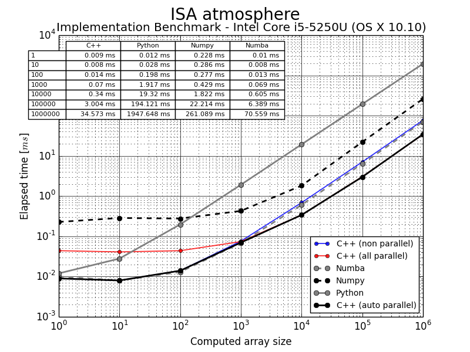

# Pyaisa v0.8.5

#### Python Yet Another International Standard Atmosphere

### Python 3 - ISA Model computed in parallel C++

[](https://coveralls.io/github/newlawrence/Pyaisa?branch=master)
[](https://anaconda.org/newlawrence/pyaisa)
[](https://anaconda.org/newlawrence/pyaisa)
[](https://conda.anaconda.org/newlawrence)

***Pysapp*** *has changed its name due to name collision with another Open Source project. Say hello to* ***Pyaisa****!*

Current continuous integration tests and automated builds available through `conda` for `Python 3.3` and `Python 3.4` using `NumPy 1.9`:

| Platform    | Site       | Status            |
|-------------|------------|:-----------------:|
| Linux-x64   | Anaconda   | [](https://anaconda.org/newlawrence/pyaisa/builds) |
| OS X-x64    | Travis CI  | [](https://travis-ci.org/newlawrence/Pyaisa) |
| Windows-x64 | Appveyor   | [](https://ci.appveyor.com/project/newlawrence/pyaisa/branch/master) |

*Due to the inability to set up succesfully OpenMP in every single CI site, automated tests and builds don't have parallel support enabled.*

## A simple Standard Atmosphere Model

This project it's only a simple standard atmosphere model that I've made for learning purposes, and to introduce myself to the Open Source world and its tools. Despite that, the **ISA model** is fully functional, fast, configurable and compliant with the [COESA](http://hdl.handle.net/2060/19770009539) stdandard.

It is written in **Python 3** with a **C++ OpenMP** powered heart using SWIG for interfacing between those two languages. If you are running a multiple core machine, pyaisa will auto-adjust itself in each situation to perform the fastest as posible.

**Pyaisa** is also fully configurable, so feel free to change every single parameter to adapt the model to whatever atmosphere you want (R, g, T0, p0, number of layers...).

Although the model is finished, there're many more things to do yet: writing the documentation, improving inline comments in the code, adding more tests... so keep an eye on future commits!

## The roots

**Pyaisa** was born in another project where the [AeroPython team](https://github.com/AeroPython) begun writting an aerospace computation toolkit, [aeropy](https://github.com/AeroPython/aeropy). Our primary goal was to learn how to work as a team and acquire skills as git/github users.

Our secondary goal was to adopt different aproaches to the problem of coding the **ISA (International Standard Atmosphere) model**, a set of equations to estimate the variation of the temperature, pressure and air density with height above sea level.

**Pyaisa** is a fork of [the work I begun then](https://github.com/AeroPython/aeropy/tree/alberto-cpp), and I've focused in cpu performance as seen in the graph:



***Pyaisa's*** *strength resides in it's ability to guess the best point to switch from single to multicore processing at import time.*

## Installation and testing

Source code installation in a **Python 3** environment via `setup.py`:

```
$ python setup.py install
```

Conda packages for Linux, OS X and Windows 64 bit plattforms are provided.

```
$ conda install pyaisa --channel newlawrence
```

To test the library:

```
python -c "from pyaisa.testing import test_library;test_library()"
```

## Brief usage instructions

The library interface is composed of: `ISA` object, and `build_atm` functions. All magnitudes are expressed in the International System of Units.

The main object is `ISA` and its main method is `atm`:

```python
>>> import pyaisa
>>> isa = pyaisa.ISA()   # Creates an ISA object with default (standard) params
>>> isa.atm(0)           # Returns temperature, pressure and density at sea level
(288.15, 101325.0, 1.225000018124288)
>>> isa.atm([0, 11000])  # Can be used with vectorial arguments
(array([288.15, 216.65]),           # Temperatures array
 array([101325., 22632.04009501]),  # Pressures array
 array([1.22500002, 0.36391765]))   # Densities array
```

Custom parameters can be defined after or in the constructor:

```python
>>> new_isa = pyaisa.ISA(R=300)      # New ISA object with custom Gas Constant
>>> new_isa.atm(0)                   # Check new density at sea level
(288.15, 101325.0, 1.1721325698420961)
>>> new_isa.params['R']
300.
>>> new_isa.params['R'] = 287.05287  # Restore default value
>>> new_isa.atm(0)
(288.15, 101325.0, 1.225000018124288)
>>> new_isa.params                   # Check all the params
{'R': 287.05287,
 'p0': 101325.0,
 'g': 9.80665,
 'T0': 288.15,
 'psize': 900,    # Size of the array to turn on parallel calculations
 'layers': {'h': array([     0.,  11000.,  20000.,  32000.]),
            'a': array([-0.0065,  0.    ,  0.001 ])}}
```

As the `ISA` object is a little ackward to use, the `build_atm` function is provided. That function returns `atm` functions built with the desired parameters. By default, `atm` function built with default parameters is provided.

```python
>>> pyaisa.atm(11000)
(216.64999999999998, 22632.040095007793, 0.3639176481016034)
>>> new_atm = pyaisa.build_atm(R=300, g=10)
>>> new_atm(11000)
(216.64999999999998, 23471.318210945108, 0.36112498209008553)
```

Functions created using `build_atm` can be used with temperature offsets as their second argument (a functionality not present in `ISA.atm` method):

```python
>>> pyaisa.atm(0, 15)  # Offsets are added to the temperature at sea level
(303.15, 101325.0, 1.1643864595827595)
>>> pyaisa.atm(11000, 15)
(231.64999999999998, 24643.196756515972, 0.3705978083423891)
```

## Borrowed code

Integration with **Travis CI** and **Appveyor** would be nearly impossible to achieve without the marvellous efforts of:

* Olivier Grisel, Jonathan Helmus, Kyle Kastner and Robert McGibbon, from whom I took the code (licensed under [Creative Commons Universal v1.0](https://creativecommons.org/licenses/by/1.0/)) to set up the Appveyor environment for working with `conda`.
* Robert McGibbon, whom magnific [python-appveyor-conda-example](https://github.com/rmcgibbo/python-appveyor-conda-example) (licensed under [Creative Commons Universal v1.0](https://creativecommons.org/licenses/by/1.0/) too) project, gave me the tools to finally manage to upload my builds to binstar (thank you so much about your excellent explanation about binstar tokens!).

## Acknowledgements

Thanks to my friend [Juan Luis Cano](https://github.com/Juanlu001). He introduced me in this marvellous world of the Open Source. This project its a tribute to him and all the fantastic [AeroPython team](https://github.com/AeroPython).